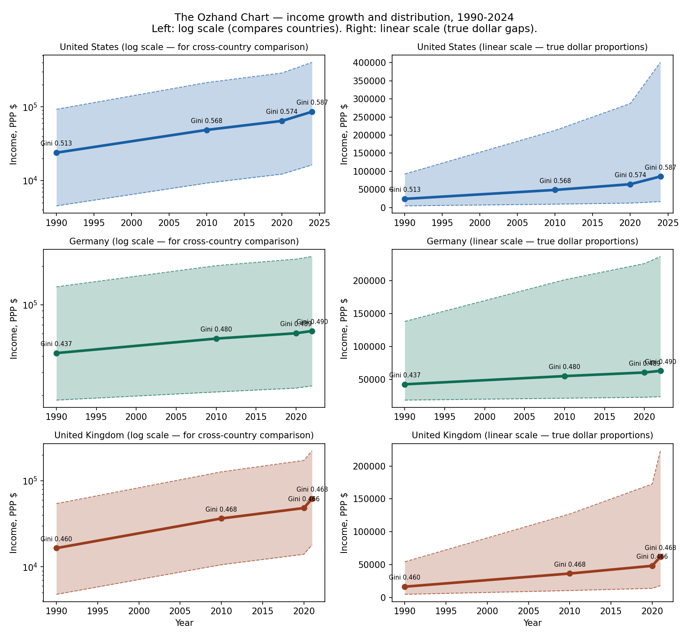
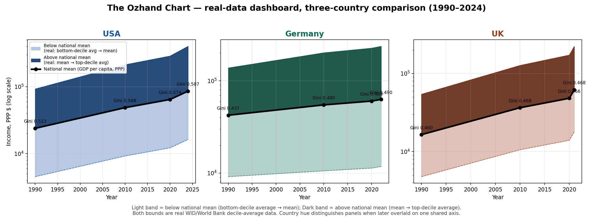
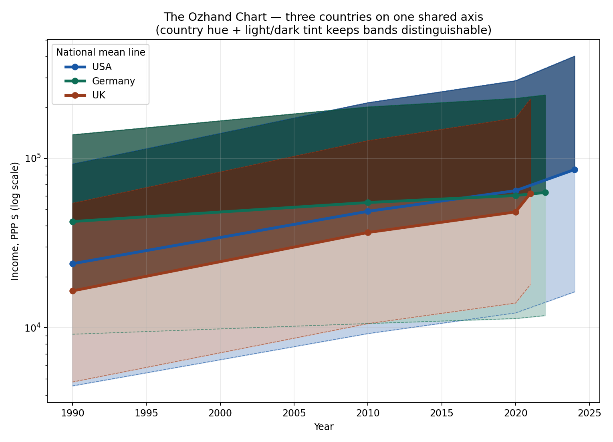

The Ozhand Chart: A Candlestick-Inspired Visualization for Cross-Country Income Growth and Distribution
Author: Ozhand (b.Ozhand96@gmail.com)
Abstract
Standard per-capita income figures (e.g. GDP per capita) summarize a country's average material standard of living but conceal how that average is distributed across the population. This paper introduces the Ozhand Chart, a visualization that plots per-capita national income over time for one or more countries as a band whose floor and ceiling correspond to the average income of the bottom and top income deciles, with a thick midline for the mean, rendered on a logarithmic vertical axis. Band width serves as a direct visual proxy for income inequality, conceptually analogous to the Gini coefficient, so a single chart lets a reader see simultaneously whether per-capita income is growing and whether that growth is broadly or narrowly shared. We situate the design relative to existing statistical and economic graphics — box plots, financial candlestick charts, central-bank fan charts, and the decile-by-country visualizations used by CORE Econ and Our World in Data — and demonstrate the method with real World Bank and World Inequality Database (WID) data for the United States, Germany, and the United Kingdom, 1990–2024. The Ozhand Chart is proposed as a complement to, not a replacement for, established distributional measures such as the Gini coefficient and the Growth Incidence Curve.
1. Why the Ozhand Chart
A wide range of existing statistical and economic visualization tools capture important parts of the relationship between economic growth and income distribution. The World Bank's Growth Incidence Curve (GIC) illustrates income growth across the income distribution between two points in time. The "elephant curve," popularized by Lakner and Milanovic (2016), shows changes in income across global percentiles over a specified period. The IMF, OECD, and national statistical institutions regularly publish income-distribution measures at the decile or percentile level. Pritchett (2022) proposed a framework bringing together growth rates, initial income levels, and growth incidence across income groups. Box plots have long been used to summarize the statistical distribution of income at a single point in time, and some studies and official statistical publications have combined distributional summaries with income-group classifications. CORE Econ's "Inequality skyscrapers" visualization displays decile-level income across many countries as a three-axis bar chart.
These approaches are each valuable, but in most cases the reader must examine several separate indicators or figures to relate aggregate economic growth to the distribution of income across the population. The Ozhand Chart is proposed as an integrated visual framework intended to bring these dimensions together in a single, continuously readable view.
To the best of our knowledge, we have not identified an existing visualization that combines, within a single continuous framework: (i) the lower and upper income groups of the distribution together with a central measure (the mean), (ii) changes in these income levels over successive years, (iii) the ability to display one or more countries within a directly comparable visual framework, and (iv) national GDP per capita represented as a distinct, directly comparable series within the same coordinate system. Each of these elements has precedent in the literature individually; their particular integration into a single longitudinal visualization is, as far as our review of the literature has established, not represented among the approaches examined for this study.
The purpose of the Ozhand Chart is therefore not to replace established measures such as the Gini coefficient, the Growth Incidence Curve, the Lorenz curve, or decile-based statistics, but to complement them by providing a visual structure in which aggregate growth and the distribution of that growth can be examined together. This distinction matters because GDP per capita and distributional equity are normally reported through separate statistics: a GDP-per-capita series shows whether average output has risen, while a Gini coefficient or decile table separately describes inequality. Reading both together requires the reader to mentally reconstruct their relationship. The Ozhand Chart seeks to reduce this fragmentation by placing income distribution and GDP per capita within one temporal, numerical framework, so that the distance between the lower and upper bounds of the band gives a direct visual indication of whether disparities are widening or narrowing over time, and the position of the mean line within that band shows whether growth is pulling the distribution upward broadly or concentrating gains toward one end.
The same framework extends to multiple countries: once income measures are converted to a common currency (and, where appropriate, purchasing-power-parity adjusted), the chart provides a shared visual basis for comparing income levels, distributional change, and aggregate growth across countries — the kind of comparison researchers and international organizations such as the World Bank or United Nations routinely need when studying development, inequality, and living standards. The chart provides visual evidence relevant to assessing distributional equity and material welfare, but it does not by itself constitute a complete measure of social welfare or governance quality, which also depend on factors such as health, education, employment, housing costs, and social protection that lie outside the scope of an income-distribution chart.
2. Related work
The Ozhand Chart draws on several existing graphical idioms, none of which individually addresses the problem described above:
Box plots (Tukey, 1977) encode a distribution's spread and central tendency in one mark, but are typically drawn per time-point as discrete, unconnected boxes, and are rarely used with a logarithmic axis for cross-country income comparison.
Financial candlestick charts use a body-and-wick idiom to show a price range around an open/close pair over discrete time intervals — an idiom that maps naturally onto "income range around a mean" but has, to our knowledge, not previously been applied to national income-distribution data.
Fan charts, introduced by the Bank of England in its February 1996 Inflation Report and documented in Britton, Fisher and Whitley (1998), show a widening band of uncertainty around a central projection over time. The Ozhand Chart borrows the "band around a midline" visual grammar, but the band here encodes an empirically observed distribution, not forecast uncertainty.
3D decile-by-country bar charts, most notably CORE Econ's "Inequality skyscrapers" (core-econ.org/inequality-skyscrapers) and the related figure in The Economy 2.0, plot decile-group average income as a three-axis bar chart across many countries simultaneously. Our World in Data's interactive "Economic Inequality" explorer similarly lets a reader browse decile-level income across countries and years, as a conventional line/bar chart. These are the closest existing precedents to the Ozhand Chart; the distinction is the continuous band-and-midline encoding used here in place of discrete 3D bars, and the explicit reading of band width as a Gini-like proxy.
3. Method
For a country in year t:
Midline m(t) = per-capita national income (GDP per capita, PPP-adjusted, current international $), sourced from the World Bank. Note that GDP per capita (total output divided by population) is conceptually distinct from mean individual or household income as measured in household surveys; the two are related but not identical, and this distinction should be kept in mind when interpreting the position of the midline relative to the decile-share-based band described next.
Ceiling h(t) = average income of the top income decile = s₁₀(t) × 10 × m(t), where s₁₀(t) is the top decile's share of national income in year t (World Inequality Database, pre-tax national income, before-tax series).
Floor l(t) = average income of the bottom of the distribution. Where available (Germany), this uses the real, cited WID "poorest 50%" income share, giving l(t) = s₅₀(t) × 2 × m(t); otherwise (USA, UK) it uses an approximate, roughly time-invariant bottom-decile share, a limitation discussed in Section 5.
The vertical axis uses a log₁₀ scale so that countries or periods spanning very different absolute income levels remain visually comparable on one chart.
Band width at time t, h(t) − l(t), increases with standard inequality measures and can be read as a visual proxy for the Gini coefficient without computing it explicitly; Section 4 cross-validates this reading against the real, independently computed Gini coefficient.
A visualization caveat worth stating plainly. On a log axis, the ceiling and floor can appear roughly equidistant from the midline even when the underlying dollar gaps are highly asymmetric, because the log scale compresses large values. For the US in 2024, the ceiling sits about 4.7× the mean and the floor about 1/5.3 of the mean; those ratios place the two lines at visually similar log-distances from the midline, but in dollar terms the gap from mean to ceiling (~$315,000) is roughly 4.5× the gap from floor to mean (~$70,000). We therefore pair every log-scale panel with a linear-scale panel showing the same data in true dollar proportions (Figure 1), and recommend any future presentation of the Ozhand Chart do the same rather than rely on the log-scale version alone.
�

Figure 1: The Ozhand Chart for USA, Germany, and UK, log scale (left) versus linear scale (right). The log-scale panels support cross-country comparison; the linear-scale panels show the true, highly asymmetric dollar gaps between the band's floor, midline, and ceiling that the log scale visually compresses.
Reading the chart: a band that rises while staying narrow indicates broadly shared income growth; a band that rises while widening indicates growth concentrated toward the top decile; a flat midline with a narrowing band indicates broad-based stagnation rather than redistribution.
4. Illustrative example: USA, Germany, UK, 1990–2024
Using World Bank GDP-per-capita PPP series and two independent real WID series — the top-decile income share and the Gini coefficient, both before-tax, both annual — three country-level Ozhand Charts were produced for 1990, 2010, 2020, and 2024. An interactive version and full reproducible code are available at https://github.com/bozhand96-collab/ozhand-chart. The Gini series lets us cross-validate the band-width reading against a standard, independently computed inequality measure rather than relying on band width alone.
Country
Mean income growth, 1990→2024
Top-decile share
Gini coefficient (before tax)
United States
23,889 → 85,810 (~3.6×)
38.8% → 46.8%
0.513 → 0.587
Germany
42,355 → 62,830 (~1.5×)
32.6% → 37.6% (2022)
0.437 → 0.490 (2022)
United Kingdom
16,505 → 62,009 (~3.8×)
32.9% → 36.0% (2021)
0.460 → 0.468 (2021)
All three countries show rising Gini coefficients over the period, confirming the band-widening pattern independently of the top-decile-share construction. The US shows both the largest proportional income growth and the largest absolute Gini increase (+0.074), consistent with the reading that its growth has been the least evenly distributed of the three. The UK's Gini barely moves (+0.008) despite the second-largest income growth, suggesting its growth has been comparatively more evenly distributed than the top-decile share alone might imply — a useful check that the two inequality measures do not always tell exactly the same story and both should be reported.
Figure 2 presents the same data as a side-by-side dashboard, with each country's band tinted in two shades of its own hue (a lighter tone from the bottom-decile average to the mean, a darker tone from the mean to the top-decile average) so that, when countries are later compared on one shared axis, bands remain visually distinguishable by hue rather than blending .
�
Figure 2: The Ozhand Chart, three-country dashboard (USA, Germany, UK), 1990–2024. Light tint: bottom-decile average → mean. Dark tint: mean → top-decile average. Black line: national mean (GDP per capita, PPP).
An alternative rendering overlays all three countries directly on one shared axis (Figure 3). This makes the relative position of the three national-mean lines easy to compare at a glance, but because the shaded bands themselves partially overlap, their blended colours are harder to read precisely where two or more countries' ranges intersect; we therefore treat Figure 2's side-by-side layout as the primary comparative view and Figure 3 as a complementary, mean-line-focused.
�
Load image
Figure 3: The Ozhand Chart, all three countries overlaid on one shared axis. Country hue distinguishes the national-mean lines clearly; the shaded bands remain informative but blend together where countries' income ranges overlap.
Citations for the reused data:
World Bank, GDP per capita, PPP (current international $).
World Inequality Database (WID.world) (2026) – with major processing by Our World in Data. "Income share of the top 10% (before tax) – WID" [dataset].
World Inequality Database (WID.world) (2026) – with major processing by Our World in Data. "Gini coefficient (before tax) – WID" [dataset].
5. Limitations
Both the top-decile share and the Gini coefficient used in Section 4 are real, annual, directly citable WID series. Two limitations remain:
Bottom-decile time series. The band's floor line uses a real annual WID series for Germany ("poorest 50%" share); for the US and UK it currently uses a single, roughly time-invariant bottom-decile share estimate rather than a real annual series. Because the Gini coefficient is included as an independent, fully real check on the inequality reading (Section 4), this limitation affects the visual floor of the band but not the paper's substantive inequality claims, which rest on the top-decile share and Gini series.
Country coverage. This study covers three countries with strong WID and World Bank coverage (USA, Germany, UK). Extending the method to countries with sparser distributional data requires supplementing WID with national statistical sources.
Future work. A natural extension is to replace the two-point (bottom-decile/top-decile) band with all ten deciles, rendered as continuous colour-graded layers rather than discrete lines, which would allow the chart to show finer-grained distributional shape (e.g. whether the middle deciles are compressed or spread out) rather than only the overall spread. We do not attempt this extension here, both because annual decile-level data of this completeness is not yet reliably available for all countries and years considered, and because it substantially increases the data-completeness burden documented in the limitation above; we flag it as a direction for future work rather than a component of the present method.
6. Supplementary material
An interactive rendering of the Ozhand Chart is available as supplementary material at the project's GitHub repository (https://github.com/bozhand96-collab/ozhand-chart, interactive/ directory). Beyond the flat log/linear figures above, the repository also includes an experimental 3D rotatable rendering ("tunnel" view) that revolves each country's band around a time axis into a hollow, vase-like solid — the solid "wall" of the shape sits only between the wick (tail) and the decile-average band, leaving the space between the two decile bounds visibly hollow, as an exploratory alternative reading of the same data. This 3D view is offered purely as a supplementary, exploratory visualization; the flat panels in Figures 1–3 remain the paper's evidentiary figures, per the discussion of graphical-perception research in the cover material accompanying this submission. The interactive page also lets a reader select a country and click any year to see the exact underlying figures for that year, with a log/linear scale toggle. The repository additionally contains the data-processing scripts and the data snapshot used to produce Section 4's figures and table, for reproducibility.
7. Generative AI Statement
Generative AI (Claude, Anthropic) was used during the development of this work for: (i) retrieving and processing publicly available World Bank and World Inequality Database data; (ii) drafting and iterating the Python code used to fetch data and render the figures in Section 4 and the supplementary interactive visualization, all of which is available in the project repository for inspection and independent verification; and (iii) drafting and revising portions of the manuscript text under the direction of, and with data-interpretation decisions made by, the author. The chart concept, its methodological definition, the choice of data sources, and all substantive analytical judgments (e.g. how to read and interpret the resulting figures) are the author's own. A record of the development conversation is available from the author upon request.
References
Britton, E., Fisher, P.G. and Whitley, J.D. (1998). "The Inflation Report projections: understanding the fan chart." Bank of England Quarterly Bulletin, 38, pp. 30–37.
CORE Econ. "Inequality skyscrapers." Interactive visualization. https://www.core-econ.org/inequality-skyscrapers/
CORE Econ. The Economy 2.0, Unit 1.4, "Inequality in global income." https://books.core-econ.org/the-economy/microeconomics/01-prosperity-inequality-04-income-inequality.html
Lakner, C. and Milanovic, B. (2016). "Global Income Distribution: From the Fall of the Berlin Wall to the Great Recession." World Bank Economic Review, 30(2), pp. 203–232.
Our World in Data. "Economic Inequality." https://ourworldindata.org/economic-inequality
Pritchett, L. (2022). On visualizing growth, distribution, and mobility together. Working paper.
Tukey, J.W. (1977). Exploratory Data Analysis. Reading, MA: Addison-Wesley.
World Bank. "Growth Incidence Curves." World Bank Poverty and Inequality Platform documentation.
World Bank. "GDP per capita, PPP (current international $)." World Development Indicators.
World Inequality Database (WID.world), with processing by Our World in Data. "Income share of the top 10% (before tax) – WID" [dataset].
World Inequality Database (WID.world), with processing by Our World in Data. "Gini coefficient (before tax) – WID" [dataset].
Concept, design, and analysis by Ozhand (b.Ozhand96@gmail.com).
